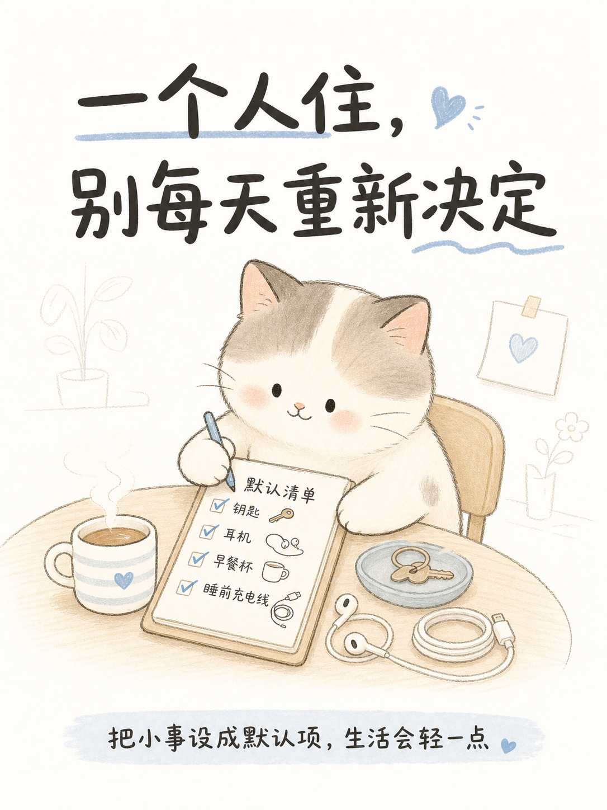
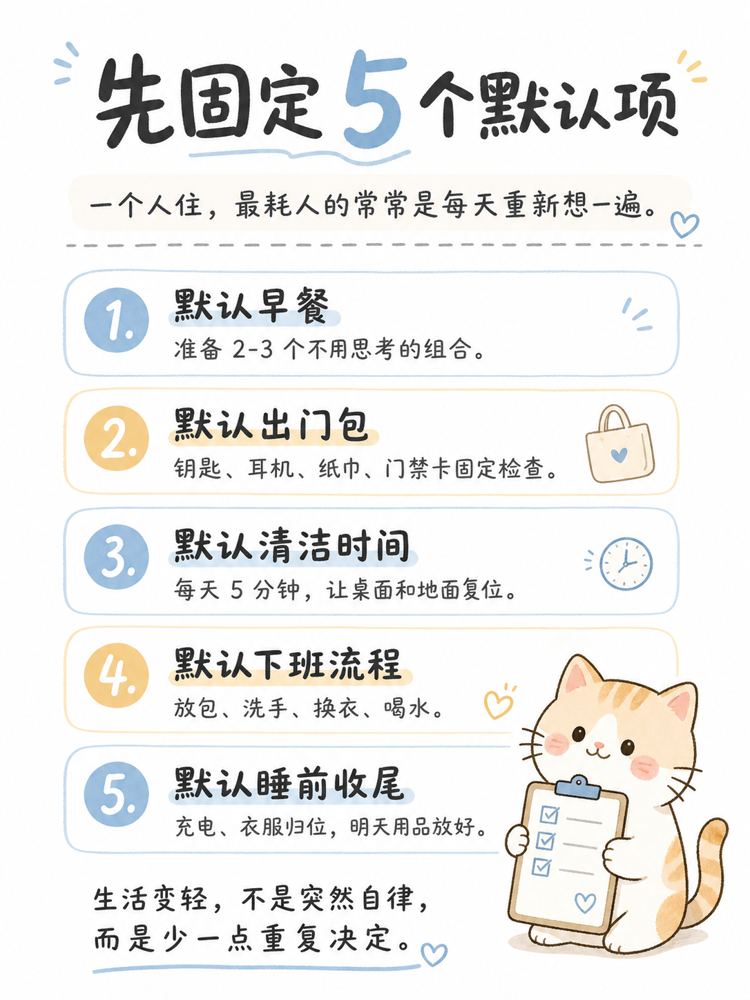
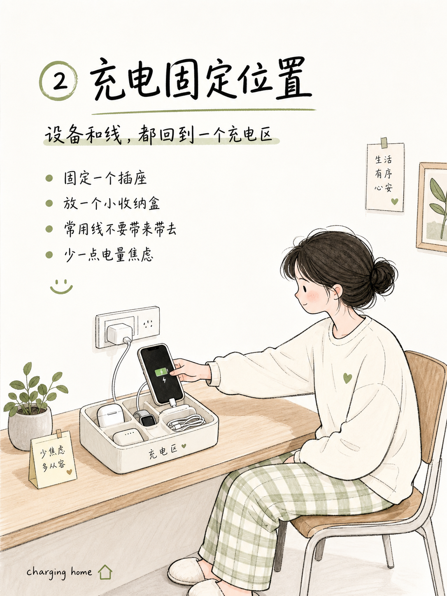

# 涂鸦卡片｜xingchen-doodle-card-skill

把任意内容转成 3:4 竖版「简洁可爱的手绘涂鸦编辑插画」提示词的 AI Skill。

适合用于小红书封面、知识卡片、公众号配图、视频号封面、内容视觉化笔记和个人图片风格工作流。

---

## Preview

  
  
  

---

## Installation

一行代码安装：

    git clone https://github.com/yxxx6666/xingchen-doodle-card-skill.git

---

## Overview

**涂鸦卡片**不是一个普通提示词模板，而是一套面向中文内容创作的 AI 视觉编译流程。

它可以把主题、文案、观点、知识点或内容结构，转化为适合 AI 生图工具使用的中文涂鸦卡片提示词。

它的目标是：

- 把抽象内容转成清晰的视觉结构
- 固定输出 3:4 竖版卡片方向
- 保持简洁、可爱、手绘、涂鸦、编辑插画风格
- 提升中文标题和文字信息的可读性
- 降低画面过载、结构混乱、文字乱码和风格漂移的风险
- 让图片提示词更稳定、更清晰、更容易复用

当前版本：**v0.6.2**

---

## What It Does

涂鸦卡片可以帮助你快速生成适合社交媒体使用的图片提示词。

你只需要输入一个主题，例如：

    普通人为什么越来越容易决策疲劳？

它会帮你整理出：

- 画面主题
- 中文标题
- 主体人物或物体
- 背景氛围
- 涂鸦元素
- 构图方式
- 色彩风格
- 文字排版要求
- 负面限制词

最终形成一段可以直接用于 AI 生图工具的提示词。

---

## Features

- 3:4 竖版卡片比例
- 中文涂鸦编辑插画风格
- 简洁可爱的视觉表达
- 适合中文标题和中文内容
- 自动拆解内容重点
- 自动组织画面主体和辅助元素
- 控制信息密度，避免画面太乱
- 强调标题醒目和文字可读性
- 适合小红书、公众号、视频号等内容场景
- 可用于个人图片风格库和 Skill 分享

---

## Use Cases

适合以下场景：

- 小红书封面图
- 小红书图文卡片
- 公众号文章配图
- 视频号封面提示词
- 知识科普卡片
- 内容选题视觉化
- AI 图片风格案例
- 提示词模板沉淀
- 个人 Skill 分享
- 中文手绘插画工作流

---

## Visual Style

默认视觉方向：

- 3:4 竖版构图
- 简洁可爱的手绘涂鸦风格
- 柔和、干净、不杂乱的背景
- 醒目的中文标题
- 清晰的信息分区
- 轻量装饰元素
- 明确主体画面
- 温馨、可爱、治愈、清爽
- 适合社交媒体传播
- 避免文字过多
- 避免画面拥挤
- 避免 AI 感过重

---

## Example Input

    主题：为什么很多人不是懒，而是被选择耗尽了？
    平台：小红书
    用途：封面图
    风格：温馨可爱、手绘涂鸦、轻松治愈
    文字：每天最累的，不是做事，而是重新决定
    比例：3:4

---

## Example Prompt Output

    Create a 3:4 vertical social media cover card in a cute hand-drawn doodle editorial illustration style.

    Main theme: decision fatigue in daily life.

    Visual composition:
    A young person sitting at a small desk, surrounded by simple floating doodle icons such as calendar, food choices, phone notifications, shopping list, and question marks. The character looks slightly tired but gentle, not dramatic.

    Layout:
    Clean vertical card layout, large Chinese title at the top, main illustration in the center, small supporting doodle elements around the character, soft background with enough whitespace.

    Chinese title text:
    「每天最累的，不是做事，而是重新决定」

    Style:
    Warm, soft, cute, simple, hand-drawn, editorial doodle illustration, clean lines, pastel colors, light beige background, friendly visual atmosphere.

    Requirements:
    Clear Chinese typography, readable title, no extra body text, no cluttered layout, no realistic photo style, no 3D rendering, no dark cyberpunk style, no messy background.

---

## Design Principles

这个 Skill 遵循以下原则：

- 内容优先，而不是装饰优先
- 结构清晰，而不是元素堆叠
- 中文可读，而不是只追求画面感
- 稳定生成，而不是随机碰运气
- 简洁、可爱、清楚、好用
- 适合普通创作者直接复用

---

## Author

Created by Xingchen.

Personal creative AI Skill for Chinese doodle editorial card generation.
