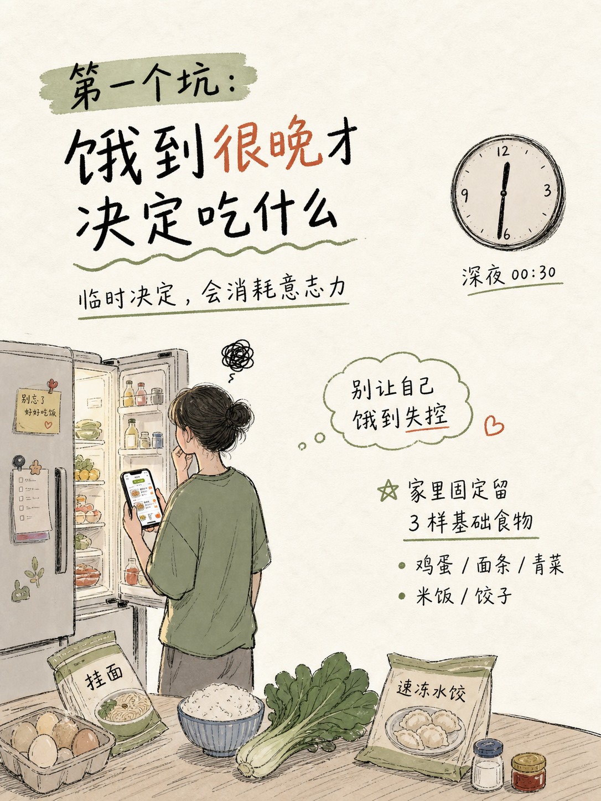

# 涂鸦卡片

一个把中文内容一次生成成 3:4 手绘涂鸦小红书卡片的 Codex Skill。

## 一句话介绍

`xingchen-doodle-card-skill` 用于把中文主题、观点、笔记或生活观察，直接交给 `image_gen.text2im` 一次生成完整的手绘涂鸦编辑卡片。

## 示例效果

| 封面卡片 | 内容页卡片 |
| --- | --- |
|  |  |

示例图展示了这个 Skill 的目标气质：柔和纸感、手写中文、生活化场景、插画与文字同画面生成，而不是后期排版叠字。

## 这是什么

这是一个面向 Codex 的图像生成 Skill，专门约束“中文手绘涂鸦卡片”的提示词、画幅、风格、禁止事项和验收标准。

它的核心原则很明确：

- 只使用 `image_gen.text2im`。
- 插画、中文标题、正文短句、场景和构图必须在同一张图里一次生成。
- 不使用 PIL、Canvas、SVG、HTML/CSS 或任何本地文字渲染。
- 不做“先生成插画，再后期叠中文”的分离式流程。
- 所有成图必须是原生 3:4 竖版画幅。

## 适合谁

- 想把小红书内容做成手绘卡片的创作者。
- 想把生活观察、学习笔记、方法论、情绪整理做成视觉图文的人。
- 需要稳定复用同一类“中文手写涂鸦卡片风格”的 Codex 用户。
- 不想手动写复杂 prompt，但希望输出统一、可控、有审美边界的人。

## 能产出什么

- 小红书 3:4 封面图。
- 连续多页图文卡片。
- 中文手写感标题卡。
- 生活方式、学习、成长、思考类手绘插画。
- 含标题、副标题、要点文字和场景插画的一体化图片。

## 视觉风格

- 手绘涂鸦插画。
- 简洁墨线和略不完美的草稿线。
- 柔和低饱和色彩。
- 大面积留白。
- 纸张纹理与温暖生活感。
- 杂志式图文构图。
- 中文文字直接融入画面。

## 快速开始

在 Codex 中直接这样描述你的需求：

```text
使用 xingchen-doodle-card-skill，帮我生成一张 3:4 小红书手绘卡片。
主题：一个人吃饭，也要好好照顾自己
标题：一个人吃饭，也是一种生活秩序
副标题：别让外卖偷走你的长期凑合
要点：
- 一顿热饭
- 一个干净碗
- 一点小秩序
```

Skill 会把内容组织成完整的 `image_gen.text2im` prompt，并要求一次生成完整图片。

## 使用方法（安装）

### 从 GitHub 安装

```powershell
git clone https://github.com/yxxx6666/xingchen-doodle-card-skill.git
Copy-Item -LiteralPath ".\xingchen-doodle-card-skill" -Destination "$env:USERPROFILE\.codex\skills\xingchen-doodle-card-skill" -Recurse -Force
```

安装后重启 Codex，或开启一个新线程，让 Skill 列表重新加载。

### 本地已有目录

如果你已经有这个目录，可以确认主文件存在：

```powershell
Test-Path "$env:USERPROFILE\.codex\skills\xingchen-doodle-card-skill\SKILL.md"
```

返回 `True` 即表示 Skill 文件在预期位置。

## 工作流程

1. 读取用户给出的中文主题、标题、正文和要点。
2. 判断适合的生活场景、主体、情绪和构图。
3. 生成完整的 `image_gen.text2im` prompt。
4. 明确要求原生 3:4 竖版画幅。
5. 直接调用 image generation 一次生成完整图片。
6. 检查画幅、中文是否在画面中、风格是否统一。
7. 如果比例失败，只重试比例，不改写主题和文字。

## 目录结构

```text
xingchen-doodle-card-skill/
├── SKILL.md
├── README.md
├── VERSION.md
├── CHANGELOG.md
├── RELEASE_REPORT.md
├── agents/
├── docs/
│   └── images/
├── examples/
├── references/
├── scripts/
├── styles/
├── templates/
└── tests/
```

重点目录：

- `SKILL.md`：Skill 主说明和执行规则。
- `templates/`：提示词与输出格式模板。
- `references/`：比例、中文文字、失败模式、验证规则等细则。
- `styles/`：视觉风格锁定规则。
- `examples/`：示例输入。
- `tests/`：检查清单与测试用例。
- `docs/images/`：README 展示用示例图。

## 设计目标

这个 Skill 的目标不是追求无限自由，而是让一种明确的内容形态稳定出现：

- 中文内容优先。
- 画面完整，不拆分生产。
- 风格统一，而不是每次随机漂移。
- 3:4 竖版输出稳定。
- 保持手绘、有温度、适合小红书阅读。
- 让用户专注表达内容，而不是反复调 prompt。

## 执行锁与比例锁

本 Skill 使用 `Execution Lock`、`Single Image Gen Authority` 和 `Aspect Ratio Lock`。这些不是风格建议，而是执行与验收规则。

比例要求：

```text
STRICT EXACT 3:4 PORTRAIT IMAGE ONLY.
native 3:4
1080×1440
1536×2048
width / height = 0.75
pass range = 0.745 to 0.755
```

错误画幅：

- `2:3`
- `4:5`
- `9:16`
- `A4`
- `long poster`

A 2:3 result is not a minor deviation. It is a failed output.

Page-by-page verification：不要批量生成整组卡片后再统一检查。每一页都要先生成、检查实际比例，通过后再继续下一页。

标准 prompt 关键词：

```text
A hand-drawn doodle editorial illustration.
Style: minimalist ink doodle, imperfect sketch lines, soft pastel accents, large white negative space.
Composition: exact 3:4 portrait card
Chinese text integrated into image:
Title:
Subtitle:
Optional points:
Mood: calm, warm, educational, reflective.
```

禁止项：

- `any external text rendering`
- `post-processing typography layers`
- `PIL/Canvas/SVG/HTML rendering`
- `CSS text systems`
- `multi-stage composition pipeline`
- `fallback renderer`

## 版本记录

当前版本：`v0.4.2`

- `v0.4.2`：加入 Aspect Ratio Lock 和逐页比例检查，要求所有图片为原生 3:4。
- `v0.4.0`：强化 Execution Lock 与 Single Image Gen Authority，只允许 `image_gen.text2im` 一次生成。

更多版本信息见 [VERSION.md](VERSION.md) 和 [CHANGELOG.md](CHANGELOG.md)。
